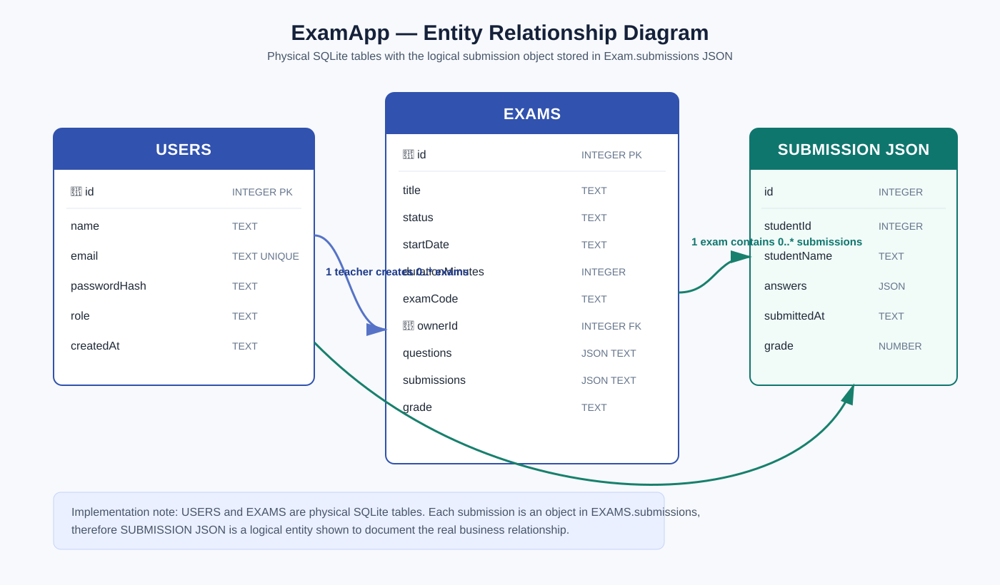
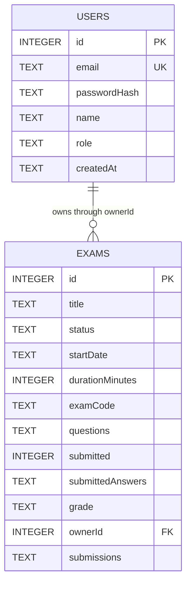
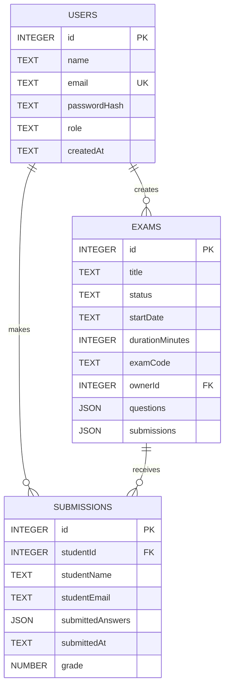

# ExamApp Entity Relationship Diagram (ERD)



## Physical SQLite schema

This is the schema that is physically stored in SQLite.



```sql
CREATE TABLE users (
  id           INTEGER PRIMARY KEY,
  email        TEXT UNIQUE NOT NULL,
  passwordHash TEXT NOT NULL,
  name         TEXT NOT NULL DEFAULT '',
  role         TEXT NOT NULL DEFAULT 'student',
  createdAt    TEXT NOT NULL DEFAULT CURRENT_TIMESTAMP
);

CREATE TABLE exams (
  id              INTEGER PRIMARY KEY,
  title           TEXT NOT NULL,
  status          TEXT NOT NULL DEFAULT 'Draft',
  startDate       TEXT NOT NULL DEFAULT '',
  durationMinutes INTEGER NOT NULL DEFAULT 30,
  examCode        TEXT,
  questions       TEXT NOT NULL DEFAULT '[]',
  submitted       INTEGER NOT NULL DEFAULT 0,
  submittedAnswers TEXT NOT NULL DEFAULT '[]',
  grade           TEXT,
  ownerId         INTEGER,
  submissions     TEXT NOT NULL DEFAULT '[]',
  FOREIGN KEY (ownerId) REFERENCES users(id)
);
```

## Logical submission relationship



## Relationship explanation

- One **teacher** user can create many exams through `EXAMS.ownerId`.
- One **student** user can create many submissions through `SUBMISSIONS.studentId`.
- One exam can receive many submissions, one per student.
- A submission belongs to exactly one student and one exam.

## Implementation note

The current SQLite schema persists `USERS` and `EXAMS` as tables. `SUBMISSIONS` is represented as objects inside the `EXAMS.submissions` JSON column rather than as a standalone table. It is shown as an entity in this ERD to clearly document the logical relationship model used by the application.

The `questions` field is similarly stored as a JSON array in the `EXAMS` table because questions are retrieved and saved together with their parent exam.
