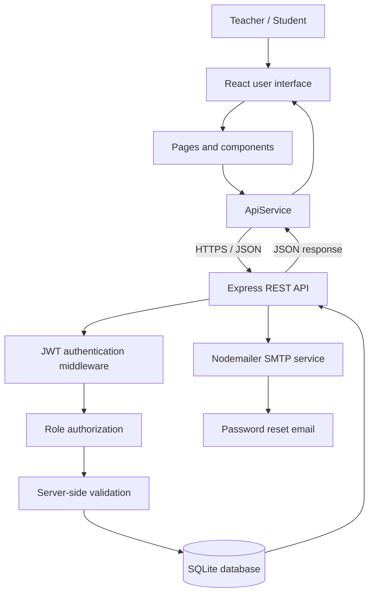
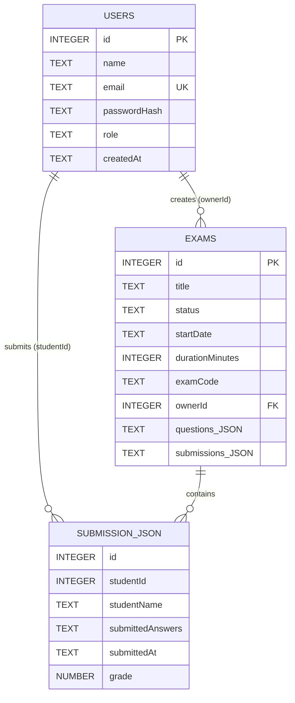

# ExamApp — Full Project Documentation

## Executive summary

ExamApp is a full-stack online exam-management application. Teachers create, edit, publish, time, and grade exams. Students register, enter a teacher-provided exam code, complete an exam once, receive an automatic submission when time expires, and view their personal grades.

The project demonstrates practical software engineering through a React frontend, an Express REST API, SQLite persistence, JWT authentication, role-based authorization, validation, automated checks, and Git-based development.

## Project goals

| Requirement | How it is demonstrated |
| --- | --- |
| Software engineering principles | Modular UI pages, service layer, middleware, validation module, tests, error feedback, and documentation. |
| Clean architecture | UI, HTTP communication, server rules, and persistence are separated. |
| Frontend/backend communication | `ApiService.js` is the single frontend HTTP boundary. |
| Database design | SQLite stores users and exams with ownership and submission data. |
| Security and validation | bcrypt, JWTs, authorization middleware, parameterized SQL, server-side validation, and environment variables. |
| Git workflow | Feature-focused commits, `CONTRIBUTING.md`, and GitHub Actions CI. |

## Technology stack

### Frontend

- React 19
- Vite
- Bootstrap 5 and custom CSS

### Backend

- Node.js and Express 5
- SQLite3
- bcryptjs for password hashes
- jsonwebtoken for access tokens
- Nodemailer for password-reset email integration

### Delivery and quality

- Git and GitHub
- GitHub Actions continuous integration
- Render configuration and Dockerfile

## Repository structure

```text
ExamApp/
├── client/
│   ├── src/
│   │   ├── components/     Reusable UI items
│   │   ├── pages/          Authentication, teacher, student, grading, and results screens
│   │   ├── services/       API calls, notifications, drafts, and local storage
│   │   ├── App.jsx         Application state and page selection
│   │   └── styles.css      Visual styling
│   └── package.json
├── server/
│   ├── data/               Runtime SQLite data; ignored by Git
│   ├── test/               Node validation tests
│   ├── server.js           Express routes, middleware, and database access
│   ├── validation.js       Reusable validation rules
│   └── package.json
├── .github/workflows/ci.yml
├── .env.example
├── ARCHITECTURE.md
├── CONTRIBUTING.md
└── PROJECT_DOCUMENTATION.md
```

## Architecture

```text
React pages
    ↓
ApiService.js
    ↓
Express REST routes
    ↓
JWT middleware + role checks + validation
    ↓
SQLite database
```

### Architecture diagram



**Diagram explanation:** React pages do not communicate directly with the database. Every request goes through `ApiService`, then Express. The server verifies identity and role, validates input, and only then reads or writes SQLite. Password-reset requests additionally use the configured SMTP service.

### Frontend responsibilities

React renders the pages, keeps temporary input state, manages notifications, runs the visible student countdown, and sends requests through `ApiService`. The browser never decides authorization; the server verifies permissions for every protected operation.

Important pages include:

- `CreateExamPage` and `EditExamPage` for teacher authoring.
- `ExamPage` for safe student question delivery and timed submission.
- `ViewAnswersPage` and `SubmissionListPage` for teacher review and grading.
- `StudentResultsPage` for a student’s private exam titles, grades, and average.
- `ForgotPasswordPage` for reset-email requests.

### Backend responsibilities

The Express server authenticates requests, enforces role permissions, validates data, persists data, and returns JSON. The server also serves the built React files in production.

## Database design

SQLite is used because it is portable, self-contained, and appropriate for an academic project.

### Users

| Field | Description |
| --- | --- |
| `id` | Primary key. |
| `name` | Display name supplied during registration. |
| `email` | Unique account email. |
| `passwordHash` | bcrypt hash; plaintext passwords are never stored. |
| `role` | `teacher` or `student`. |
| `createdAt` | Account creation time. |

### Exams

| Field | Description |
| --- | --- |
| `id` | Primary key. |
| `title` | Exam title. |
| `status` | `Draft`, `Published`, or `Closed`. |
| `startDate` | Teacher-selected date. |
| `durationMinutes` | Time limit, 1–240 minutes. |
| `examCode` | Student access code. |
| `ownerId` | Teacher who created the exam. |
| `questions` | JSON array of questions. |
| `submissions` | JSON array containing student identity, answers, timestamp, and grade. |

Questions and submissions are stored with their exam because they are always retrieved as part of that exam. Ownership is still persisted through `ownerId`, and each submission stores the student’s ID.

### Database relationship diagram



**Database design note:** `SUBMISSION_JSON` represents an object inside the `exams.submissions` JSON array, not a separate SQLite table. It is shown in the diagram to make the relationship between students, exams, and submissions explicit.

## Key workflows

### Teacher workflow

1. Register or sign in as a teacher.
2. Create an exam with a title, status, date, code, and duration.
3. Add open or multiple-choice questions.
4. Publish the exam.
5. Open the **Submitted** counter to see all submissions across student accounts.
6. Review a submission, enter a grade, and save it.
7. Use the dashboard snapshot to see the average across graded submissions.

### Student workflow

1. Register with name, email, password, and student role.
2. Enter a teacher-provided exam code.
3. Receive questions without correct answers.
4. Answer questions while the configured countdown runs.
5. Submit manually or allow automatic submission at zero.
6. The same student cannot access or submit that exam again.
7. Open **My Results** to see completed exam names, assigned grades, and average grade.

### Password-reset workflow

1. Select **Forgot password?** from the sign-in screen.
2. Enter an email address.
3. The frontend calls the reset request API.
4. The server creates a 30-minute signed reset token.
5. With SMTP configuration present, Nodemailer delivers the email.
6. The page confirms that the password reset email has been sent.

## REST API

| Method | Endpoint | Authorization | Description |
| --- | --- | --- | --- |
| `GET` | `/api/health` | Public | Health check. |
| `POST` | `/api/auth/register` | Public | Register account. |
| `POST` | `/api/auth/login` | Public | Sign in and receive JWT. |
| `POST` | `/api/auth/forgot-password` | Public | Request password-reset email. |
| `GET` | `/api/auth/me` | Authenticated | Current user profile. |
| `GET` | `/api/exams` | Authenticated | Teacher-owned or student-available exams. |
| `POST` | `/api/exams` | Teacher | Create exam. |
| `PUT` | `/api/exams/:id` | Teacher | Save questions, status, duration, and grades. |
| `DELETE` | `/api/exams/:id` | Teacher | Delete owned exam. |
| `POST` | `/api/exams/:id/submissions` | Student | Submit answers once. |
| `GET` | `/api/student/submissions` | Student | Student’s own results only. |

## Security and validation

### Security controls

- Passwords are hashed with bcrypt.
- JWT access tokens expire after two hours.
- Protected requests send `Authorization: Bearer <token>`.
- Teacher-only routes use middleware that checks the authenticated role.
- SQL uses parameters instead of query-string interpolation.
- Student exam responses remove the teacher’s `correctAnswer` field.
- A student can submit each exam only once.
- Runtime database files and environment files are ignored by Git.

### Server-side validation

The server validates input in `server/validation.js` even when the frontend has its own form checks:

- valid email address;
- password of at least eight characters;
- name from 1 to 80 characters;
- required exam title;
- allowed exam status;
- questions must be an array;
- duration must be an integer from 1 to 240 minutes.

## Development process

The application was developed incrementally, with each feature tested before moving to the next one.

1. **Structure:** organized the repository into client pages/components/services and server API/validation/tests.
2. **Authentication:** implemented registration, login, JWT persistence, teacher/student roles, and protected endpoints.
3. **Exam management:** implemented teacher exam creation, editing, questions, codes, publishing, and local drafts.
4. **Persistence:** added SQLite initialization, schema migrations, ownership, and data mapping.
5. **Student experience:** added code-only access, safe question delivery, answer collection, and one-time submission rules.
6. **Grading:** added all-submission lists, answer review, teacher grades, and teacher/student averages.
7. **Timed exams:** added duration settings and automatic submission when the countdown ends.
8. **Password recovery:** added the forgot-password UI, reset-token creation, and SMTP mail integration.
9. **Quality:** added validation tests, CI, user feedback, error handling, documentation, and a visual style pass.

This approach kept changes small, made failures easier to isolate, and produced a meaningful commit history.

## Local installation

### Prerequisites

- Node.js 20+
- npm

### Run locally

```bash
cd client
npm install
npm run build

cd ../server
npm install
npm start
```

Open `http://127.0.0.1:5000`.

### Frontend development mode

Run the frontend and backend in separate terminals:

```bash
# terminal 1
cd client
npm run dev

# terminal 2
cd server
npm run dev
```

The development client targets the API on port 5000 unless `VITE_API_BASE_URL` is supplied.

## Environment configuration

Copy `.env.example` to `.env` and set the values below.

| Variable | Purpose |
| --- | --- |
| `JWT_SECRET` | Required in production; signs access and reset tokens. |
| `APP_URL` | Public URL used to create reset links. |
| `SMTP_HOST`, `SMTP_PORT`, `SMTP_SECURE` | SMTP connection configuration. |
| `SMTP_USER`, `SMTP_PASS`, `SMTP_FROM` | Mail account credentials and sender. |
| `VITE_API_BASE_URL` | Optional separate backend URL for the frontend. |

## Testing and quality assurance

### Automated checks

```bash
# client
npm run build

# server
npm test
```

The GitHub Actions workflow installs dependencies, builds the frontend, and runs server tests for every push and pull request.

### Manual acceptance checklist

- Register teacher and student accounts.
- Create, edit, publish, and time an exam.
- Enter an exam code as a student and verify questions render.
- Submit once and confirm the exam cannot be reopened by the same student.
- Test automatic submission using a short duration.
- Grade a submission and confirm averages update.
- Confirm a student sees only their own results.
- Test forgot password with SMTP configured.

## Git workflow

The `dev` branch is used for active work. A normal feature workflow is:

```bash
git switch -c feature/short-description
git add .
git commit -m "feat: concise change description"
git push origin feature/short-description
```

Open a pull request, explain the implementation and test evidence, and merge only after review and CI success. See `CONTRIBUTING.md` for the project’s contribution rules.

## Deployment

`render.yaml` provides a Render deployment configuration. In production, the Express server serves the built frontend from `client/dist`.

Before deployment:

1. Set a strong `JWT_SECRET`.
2. Set `APP_URL` to the deployed HTTPS address.
3. Configure SMTP values if password-reset delivery is required.
4. Use persistent storage for SQLite or migrate to a managed database for a larger production deployment.

## Future improvements

- Add the final reset-password form that consumes the emailed token.
- Persist timed-session start timestamps on the server so timers survive browser reload.
- Move submissions into a normalized database table for advanced reporting.
- Add marks per question and automatic grading for multiple-choice questions.
- Add integration and browser end-to-end tests.

## Conclusion

ExamApp is a complete academic full-stack project. It demonstrates a clear architecture, secure account handling, protected REST communication, persistent data, teacher/student role flows, timed exams, grading, reporting, validation, testing, documentation, and Git-based delivery.
