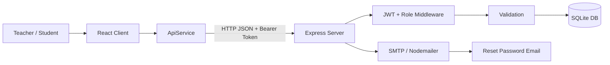
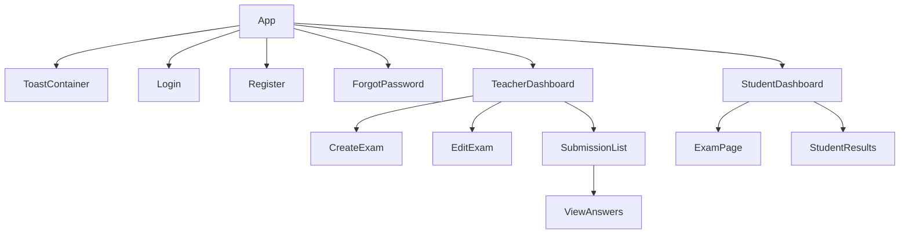
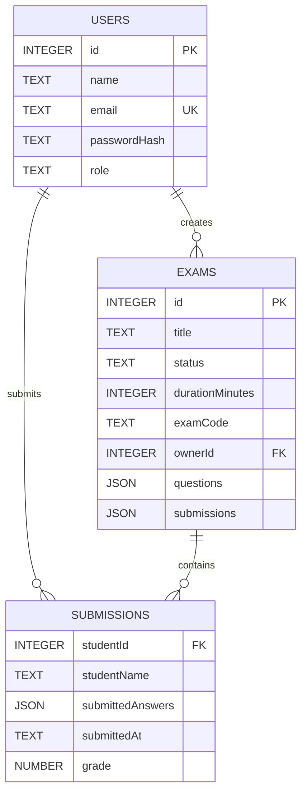
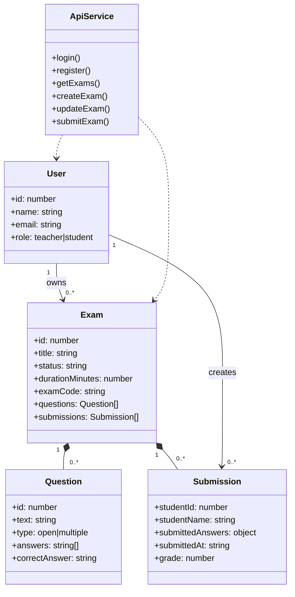
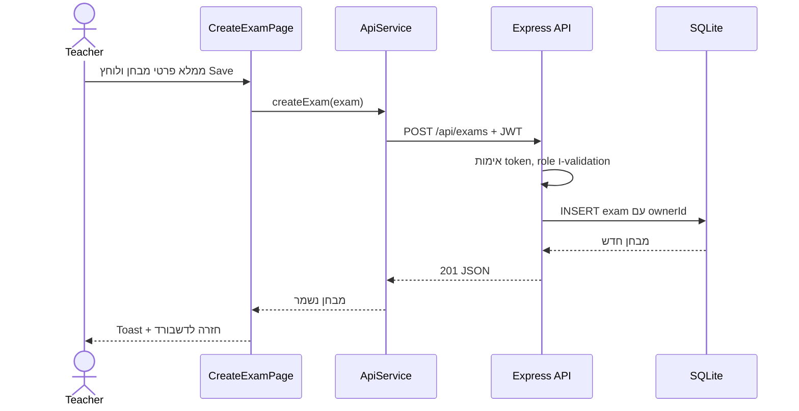
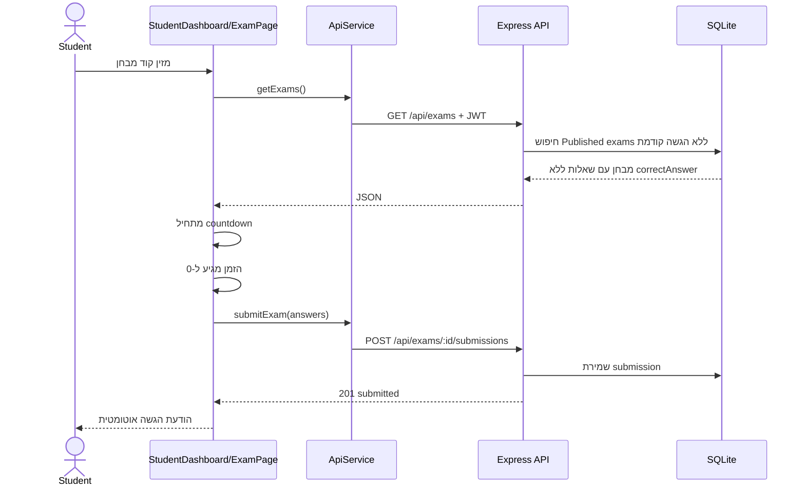
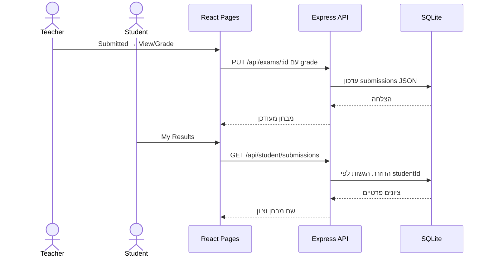

# ExamApp — מסמך תיעוד והגשה

## 1. קישורים

| פריט | כתובת / מיקום |
| --- | --- |
| GitHub Repository | [github.com/gadeeribr-a11y/ExamApp](https://github.com/gadeeribr-a11y/ExamApp) |
| ענף פיתוח פעיל | `dev` |
| Deploy | מוגדר ל־Render באמצעות [`render.yaml`](render.yaml). לאחר פריסה ראשונה יש להדביק כאן את כתובת ה־Render הציבורית שהתקבלה. |
| תיעוד מלא באנגלית | [PROJECT_DOCUMENTATION.md](PROJECT_DOCUMENTATION.md) |
| ERD וסכמת בסיס הנתונים | [ERD.md](ERD.md) |

> לא הומצאה כתובת Deploy: קובץ `render.yaml` קיים ומגדיר את הפריסה, אך כתובת Render ציבורית אינה נשמרת בתוך הקוד. בזמן ההגשה יש להוסיף את כתובת השירות שנוצרת ב־Render.

---

## 2. תקציר הפרויקט

**ExamApp** היא מערכת מלאה לניהול מבחנים מקוונים. למערכת שני סוגי משתמשים:

- **Teacher** — יוצר מבחנים, מגדיר זמן, מוסיף שאלות, מפרסם, צופה בהגשות ובודק ציונים.
- **Student** — נרשם, מזין קוד מבחן, נבחן פעם אחת בלבד, מקבל הגשה אוטומטית בסיום הזמן וצופה בתוצאות האישיות שלו.

הפרויקט הוא Full Stack: ממשק React, שרת Express, מסד נתונים SQLite ואימות JWT.

---

## 3. פיצ'רים מרכזיים, דפים ו־API

### פיצ'רים מרכזיים

| פיצ'ר | תיאור |
| --- | --- |
| הרשמה והתחברות | חשבונות Teacher/Student, סיסמאות מוצפנות, token מסוג JWT. |
| יצירת מבחן | שם, תאריך, סטטוס, קוד גישה ומשך זמן בדקות. |
| ניהול שאלות | שאלות פתוחות ורב־ברירה; שמירת טיוטה מקומית. |
| מבחן מוגבל בזמן | ספירה לאחור לפי הגדרת המורה והגשה אוטומטית באפס. |
| הגשה חד־פעמית | תלמיד לא יכול להגיש או להיכנס לאותו מבחן פעם נוספת. |
| בדיקת מבחנים | רשימת הגשות, שם תלמיד, תשובות, ציון ושמירה. |
| תוצאות | התלמיד רואה רק את המבחנים שסיים, ציוניו והממוצע שלו. |
| שחזור סיסמה | מסך Forgot Password ואינטגרציה לשליחת email דרך SMTP. |

### דפים מרכזיים

| דף | קובץ | תפקיד |
| --- | --- | --- |
| Login | `pages/LoginPage.jsx` / `App.jsx` | כניסה למערכת. |
| Register | `pages/RegisterPage.jsx` | יצירת חשבון עם שם, email, סיסמה ותפקיד. |
| Teacher Dashboard | `pages/TeacherDashboard.jsx` | ניהול מבחנים, סטטיסטיקות והגשות. |
| Create/Edit Exam | `pages/CreateExamPage.jsx`, `pages/EditExamPage.jsx` | יצירה, הגדרות, שאלות וזמן. |
| Student Dashboard | `pages/StudentDashboard.jsx` | כניסה למבחן באמצעות קוד בלבד. |
| Exam | `pages/ExamPage.jsx` | הצגת שאלות, תשובות, טיימר והגשה. |
| Grade Submissions | `pages/ViewAnswersPage.jsx`, `pages/SubmissionListPage.jsx` | צפייה ובדיקה של הגשות. |
| Student Results | `pages/StudentResultsPage.jsx` | שם מבחן, ציון וממוצע אישי. |
| Forgot Password | `pages/ForgotPasswordPage.jsx` | בקשת שליחת email לאיפוס סיסמה. |

### API מרכזי

| Method | Endpoint | הרשאה | תפקיד |
| --- | --- | --- | --- |
| `POST` | `/api/auth/register` | Public | הרשמה. |
| `POST` | `/api/auth/login` | Public | התחברות והחזרת JWT. |
| `POST` | `/api/auth/forgot-password` | Public | בקשת email לאיפוס. |
| `GET` | `/api/exams` | JWT | מבחני המורה או מבחנים זמינים לתלמיד. |
| `POST` | `/api/exams` | Teacher | יצירת מבחן. |
| `PUT` | `/api/exams/:id` | Teacher | עדכון מבחן, שאלות, זמן וציונים. |
| `POST` | `/api/exams/:id/submissions` | Student | הגשה חד־פעמית. |
| `GET` | `/api/student/submissions` | Student | תוצאות פרטיות של תלמיד. |

---

## 4. ארכיטקטורה כללית — Client, Server, DB, Services



### מי מדבר עם מי?

1. המשתמש מפעיל פעולה בדף React.
2. הדף משתמש ב־`ApiService` בלבד לבקשת HTTP.
3. Express מקבל את הבקשה, מפעיל `authenticateToken` במקרה הצורך ובודק תפקיד דרך `requireTeacher`.
4. `validation.js` בודק את הקלט בשרת.
5. השרת קורא/כותב ל־SQLite בעזרת שאילתות פרמטריות.
6. השרת מחזיר JSON; React מעדכן state ומציג toast או מסך מתאים.

### היכן נשמר מידע?

| מידע | מקום שמירה |
| --- | --- |
| משתמשים, מבחנים, שאלות והגשות | SQLite: `server/data/exams.db` |
| JWT של משתמש מחובר | `localStorage` בדפדפן תחת `authToken` |
| טיוטת מבחן בזמן עריכה | `localStorage` דרך `DraftService` |
| סיסמה | לא נשמרת כטקסט; נשמר רק bcrypt hash במסד הנתונים |

---

## 5. ארכיטקטורת Client

### Packages

| Package | שימוש |
| --- | --- |
| `react`, `react-dom` | בניית ממשק משתמש ורינדור. |
| `vite` | סביבת פיתוח ו־build. |
| `@vitejs/plugin-react` | תמיכה ב־React בתוך Vite. |
| Bootstrap 5 | בסיס עיצובי, נטען ב־`index.html`. |

### Component hierarchy



### ארגון בסגנון MVC בצד הלקוח

- **View:** רכיבי React ב־`pages/` וב־`components/`.
- **Model:** אובייקטי Exam/Question/User ותוצאות ה־API.
- **Controller / Service:** `App.jsx` שולט ב־state ובניווט; `ApiService.js` שולט בתקשורת עם השרת.

---

## 6. ארכיטקטורת Server

### Packages

| Package | שימוש |
| --- | --- |
| `express` | REST API ו־middleware. |
| `sqlite3` | מסד הנתונים. |
| `bcryptjs` | הצפנת סיסמאות. |
| `jsonwebtoken` | יצירה ובדיקה של JWT. |
| `cors` | מאפשר תקשורת Client/Server בפיתוח. |
| `nodemailer` | שליחת email לאיפוס סיסמה דרך SMTP. |

### שכבות Server

```text
Route → Authentication → Authorization → Validation → SQLite → JSON Response
```

- `server.js` מכיל את routes, middleware ואתחול DB.
- `validation.js` מכיל כללי תקינות לקלט.
- `authenticateToken` מאמת JWT.
- `requireTeacher` חוסם פעולות ניהול למשתמש שאינו מורה.
- `runQuery` ו־`runStatement` מבצעים שאילתות SQLite בצורה אסינכרונית.

---

## 7. DB, ERD ו־JSON Models

### ERD לוגי



פירוט מלא של ERD וסכמת SQL נמצא ב־[ERD.md](ERD.md). בפועל `submissions` נשמר כ־JSON בתוך שורת המבחן; התרשים מציג אותו כישות לוגית כדי להבהיר את הקשרים.

קיים גם קובץ ERD מצויר להגשה או להצגה: [ExamApp_ERD.svg](diagrams/ExamApp_ERD.svg).

### JSON Models

```json
{
  "id": 101,
  "title": "Mathematics",
  "status": "Published",
  "durationMinutes": 30,
  "examCode": "MATH30",
  "ownerId": 7,
  "questions": [
    { "id": 1, "text": "2 + 2 = ?", "type": "multiple", "answers": ["3", "4"], "correctAnswer": "B" }
  ],
  "submissions": [
    { "id": 501, "studentId": 12, "studentName": "Dana Cohen", "submittedAnswers": { "1": "4" }, "submittedAt": "2026-07-20T10:00:00.000Z", "grade": 100 }
  ]
}
```

כאשר תלמיד מקבל מבחן, השרת מסיר את `correctAnswer` מהשאלות לפני החזרת JSON.

---

## 8. OOP UML Diagram



---

## 9. Sequence diagrams — תרחישים מרכזיים

### Scenario A: מורה יוצר מבחן



### Scenario B: תלמיד מתחיל מבחן ומוגש אוטומטית



### Scenario C: מורה בודק ותלמיד רואה ציון



---

## 10. Milestones ומבנה ענפים

### Milestones לפי היסטוריית Git

1. הקמת Backend Express ו־CRUD ראשוני.
2. חיבור Frontend ל־Backend.
3. מעבר מ־JSON ל־SQLite ו־persistent storage.
4. הוספת JWT והרשאות תפקידים.
5. Docker ו־cloud deployment readiness.
6. פעולות Dashboard למורה.
7. שיפור exam workflow, grading, results וטיימר.
8. CI, בדיקות, תיעוד, ERD/UML/Sequence.

### ענפים

| ענף | תפקיד |
| --- | --- |
| `main` | גרסה יציבה. |
| `dev` | פיתוח ואינטגרציה של הפיצ'רים האחרונים. |
| `feature/dark-mode` | פיתוח UI/עיצוב. |
| `feature/login-page` | פיתוח מסך התחברות. |
| `feature/1-specfile` | עבודה מול מסמך דרישות. |

### דוגמאות ל־commits מרכזיים

- `feat: wire teacher dashboard actions to backend`
- `feat: complete secure exam management workflow`
- `feat: finalize submissions and student results`
- `feat: add timer for exams`
- `feat: add forgot password flow`

---

## 11. תהליכי עבודה, בדיקות, Docker ו־Deploy

### בדיקות

```bash
# Frontend build
cd client
npm run build

# Server tests
cd ../server
npm test
```

- `npm run build` בודק שה־React application מתקמפל.
- `npm test` מריץ בדיקות Node עבור validation של משתמשים ומבחנים.
- GitHub Actions מריץ התקנת dependencies, build ובדיקות בכל push ו־pull request.

### לוגים וטיפול בשגיאות

- בצד שרת: `console.error` עבור כשלי register/login/database/submission.
- בצד לקוח: errors נרשמים ל־console ומוצגים למשתמש באמצעות Toast.
- ב־Render ניתן לראות את לוגי השרת מתוך Dashboard של השירות.

### Docker

קיים `Dockerfile` עם build stage ל־client ו־runtime stage לשרת. בזמן runtime Express מגיש את `client/dist` ואת ה־API מאותו process.

```bash
docker build -t examapp .
docker run -p 10000:10000 -e JWT_SECRET=change-me examapp
```

### Render

`render.yaml` מגדיר:

- `buildCommand`: התקנת dependencies ובניית client.
- `startCommand`: הפעלת `server/server.js`.
- `PORT=10000` ו־`NODE_ENV=production`.

לפני deploy יש להגדיר ב־Render את `JWT_SECRET` ובמידת הצורך משתני SMTP לאיפוס סיסמה.

---

## 12. סיכום

המערכת מדגימה פרויקט Full Stack שלם: UI מודולרי, API מאובטח, SQLite, הרשאות תפקידים, תהליכי מבחן ובדיקה, טיימר, תוצאות פרטיות, בדיקות, CI ותהליך Git מסודר. התרשימים והתרחישים במסמך זה מתארים את המערכת גם ברמת־על וגם ברמת מעבר הנתונים בפועל.
